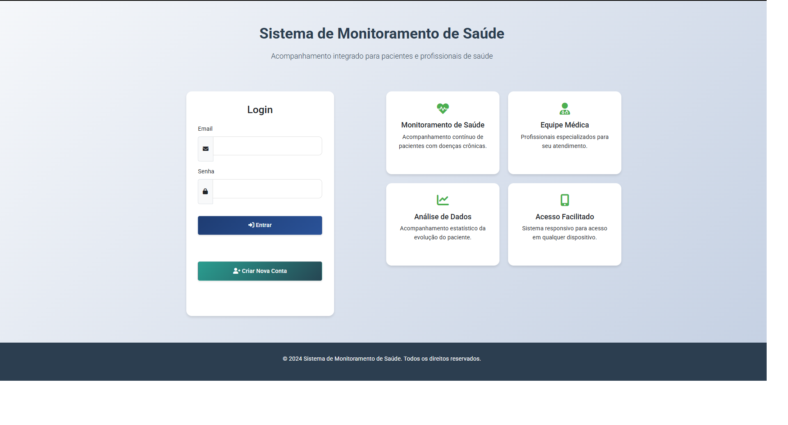
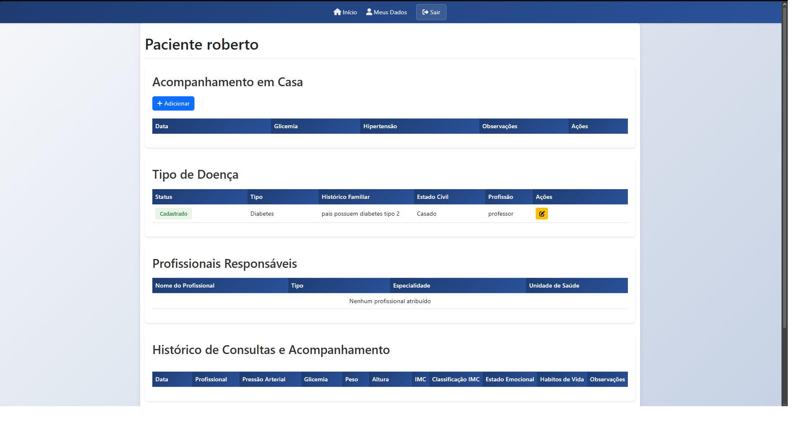
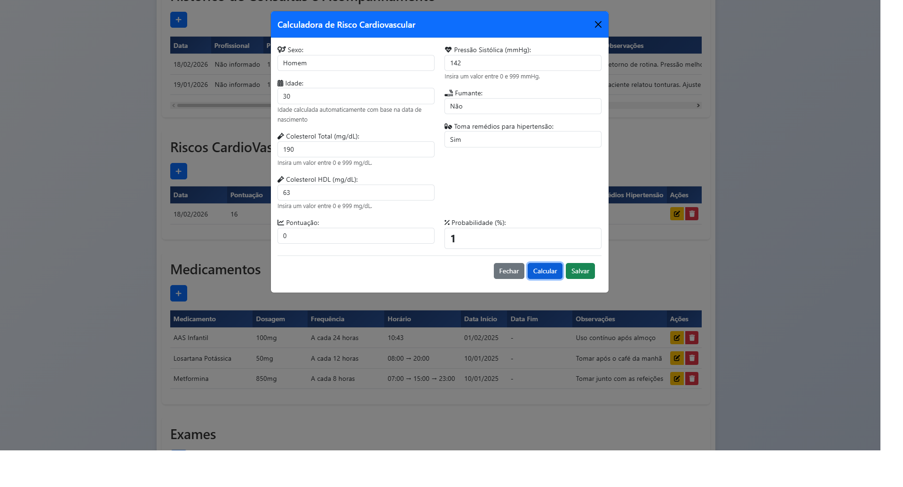
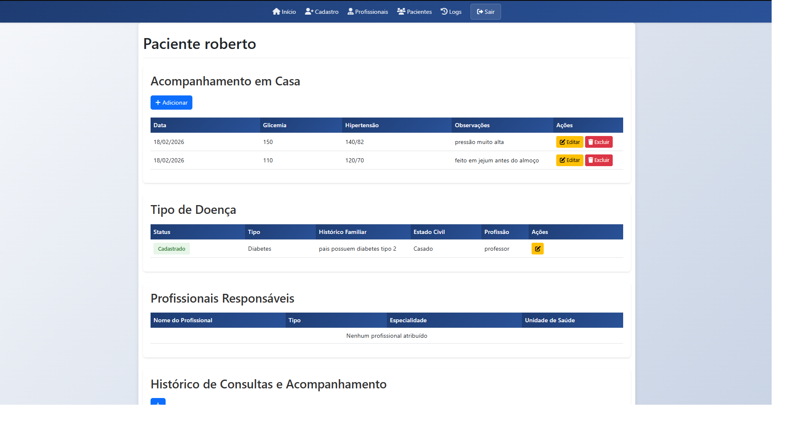

# 🏥 Sistema de Monitoramento de Saúde & DCNT

> Uma plataforma completa para gestão de saúde pública e privada, focada no acompanhamento de pacientes com Doenças Crônicas Não Transmissíveis (DCNTs).

*(Dica: Substitua essa linha acima por um GIF navegando pelo sistema)*

## 📄 Sobre o Projeto

Este sistema foi desenvolvido para facilitar o trabalho de equipes multidisciplinares de saúde (Médicos, Enfermeiros e Agentes Comunitários - ACS) no monitoramento contínuo de pacientes.

O foco principal é o controle de **Hipertensão** e **Diabetes**, permitindo o registro histórico de aferições, controle medicamentoso e cálculo automático de riscos cardiovasculares.

### 🎯 Principais Funcionalidades

* **👥 Controle de Acesso por Papéis (RBAC):**
    * **Admin:** Gestão completa do sistema.
    * **Médico/Enfermeiro:** Prontuário eletrônico, prescrições e análise de exames.
    * **ACS (Agente Comunitário):** Atualização de dados em visitas domiciliares.
    * **Paciente:** Acesso aos seus próprios dados, receitas e agendamentos.
* **📊 Dashboard Inteligente:** Visualização rápida de estatísticas e pacientes em estado crítico.
* **🫀 Calculadora de Risco Cardiovascular:** Algoritmo integrado que calcula a probabilidade de eventos cardiovasculares com base em dados clínicos (Idade, Colesterol, PA, Tabagismo).
* **💊 Gestão Farmacêutica:** Controle de medicamentos em uso, dosagens e horários.
* **📱 Recursos PWA:** Implementação de Service Workers para notificações e acesso facilitado em dispositivos móveis.
* **🔔 Sistema de Notificações:** Alertas para horários de medicamentos e consultas.

## 🛠️ Tecnologias Utilizadas

**Backend & Banco de Dados**
*  **PHP Nativo:** Arquitetura MVC personalizada sem dependência de frameworks pesados.
*  **MySQL:** Banco de dados relacional complexo com gestão de relacionamentos (Paciente x Profissional).

**Frontend**
*  **Bootstrap 5:** Interface responsiva e moderna.
*  **jQuery & AJAX:** Requisições assíncronas para uma experiência fluida (SPA-like).
*  **Service Workers:** Funcionalidades de Push Notification e Web App.

**Ferramentas & Libs**
* **SweetAlert2:** Alertas modais interativos e amigáveis.
* **Select2:** Caixas de seleção com busca inteligente.
* **Chart.js:** Visualização de dados gráficos.

## 📸 Galeria

| Dashboard & Métricas | Prontuário do Paciente |
|:---:|:---:|
|  |  |
| *Visão geral para profissionais* | *Histórico clínico detalhado* |

| Ferramentas Avançadas | Controle Farmacêutico |
|:---:|:---:|
|  |  |
| *Algoritmo automatizado de risco cardiovascular* | *Controle de dispensação e horários de medicação* |

## 🚀 Como Executar (Ambiente de Desenvolvimento)

Este é um projeto proprietário/privado. Abaixo descrevo a arquitetura para fins de demonstração técnica.

**Pré-requisitos:**
* Servidor Web (Apache/Nginx)
* PHP 7.4 ou superior
* MySQL 5.7+

**Estrutura do Banco de Dados:**
O sistema utiliza tabelas relacionais principais:
* `usuarios`: Tabela central com discriminação via coluna `tipo_usuario`.
* `pacientes` & `profissionais`: Extensões da tabela de usuários.
* `consultas`, `exames`, `medicamentos`: Tabelas transacionais vinculadas aos pacientes.
* `riscos_saude`: Tabela histórica de cálculos de risco.

---
**Nota:** Este repositório serve como portfólio para demonstrar minhas habilidades em desenvolvimento Full Stack, Arquitetura de Banco de Dados e UX para sistemas de saúde. O código-fonte completo é privado.

📫 **Interessado no projeto?** Entre em contato comigo: [Seu Email/LinkedIn]
