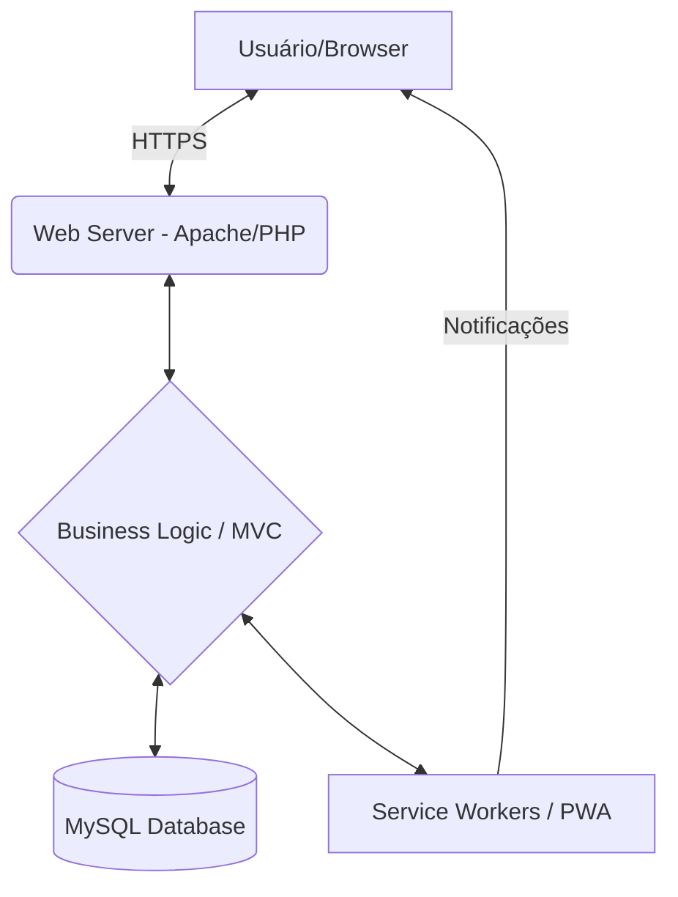

# 🏥 Sistema de Monitoramento de Saúde & DCNT

> Uma plataforma completa para gestão de saúde pública e privada, focada no acompanhamento de pacientes com Doenças Crônicas Não Transmissíveis (DCNTs).


## 🎯 Objetivo e Problema

### O Problema
O acompanhamento de pacientes com doenças crônicas (DCNTs), como Hipertensão e Diabetes, muitas vezes é fragmentado. Equipes de saúde enfrentam dificuldades em manter um histórico centralizado, calcular riscos de forma rápida e garantir a adesão medicamentosa, o que pode levar a complicações evitáveis.

### O Objetivo
Prover uma ferramenta unificada que centraliza o prontuário, automatiza cálculos clínicos (como o Risco Cardiovascular) e facilita a comunicação entre diferentes níveis de atendimento (Médico, ACS, Paciente), melhorando o desfecho clínico e a gestão de recursos.

## 🏗️ Arquitetura do Sistema



O sistema utiliza uma arquitetura **MVC (Model-View-Controller)** implementada em PHP Puro para garantir leveza e controle total sobre as regras de negócio de saúde.

## 🛠️ Tecnologias Utilizadas

**Backend & Banco de Dados**
*  **PHP Nativo:** Arquitetura MVC robusta.
*  **MySQL:** Modelagem relacional complexa.

**Frontend**
*  **Bootstrap 5.**
*  **jQuery & AJAX.**

## 🚀 Como Executar

### Desenvolvimento Local
1. Clone este repositório.
2. Configure um servidor Apache/PHP (como XAMPP ou Laragon).
3. Importe o schema do banco de dados (disponível sob consulta).
4. Configure as credenciais no arquivo `config.php`.


## 📡 Exemplos de API (Requests/Responses)

### Cálculo de Risco Cardiovascular
**Request:** `POST /api/calcular-risco`
```json
{
  "idade": 55,
  "sexo": "masculino",
  "pa_sistolica": 140,
  "fumante": true,
  "colesterol_total": 200
}
```

**Response:**
```json
{
  "risco": "alto",
  "probabilidade": "20%",
  "recomendacao": "Encaminhamento prioritário para cardiologia."
}
```

## 📸 Galeria & Interface

| Dashboard & Métricas | Prontuário do Paciente |
|:---:|:---:|
|  |  |

| Ferramentas Avançadas | Controle Farmacêutico |
|:---:|:---:|
|  |  |

---
**Nota:** Este repositório serve como portfólio técnico. O código-fonte principal é privado para proteção de propriedade intelectual.

